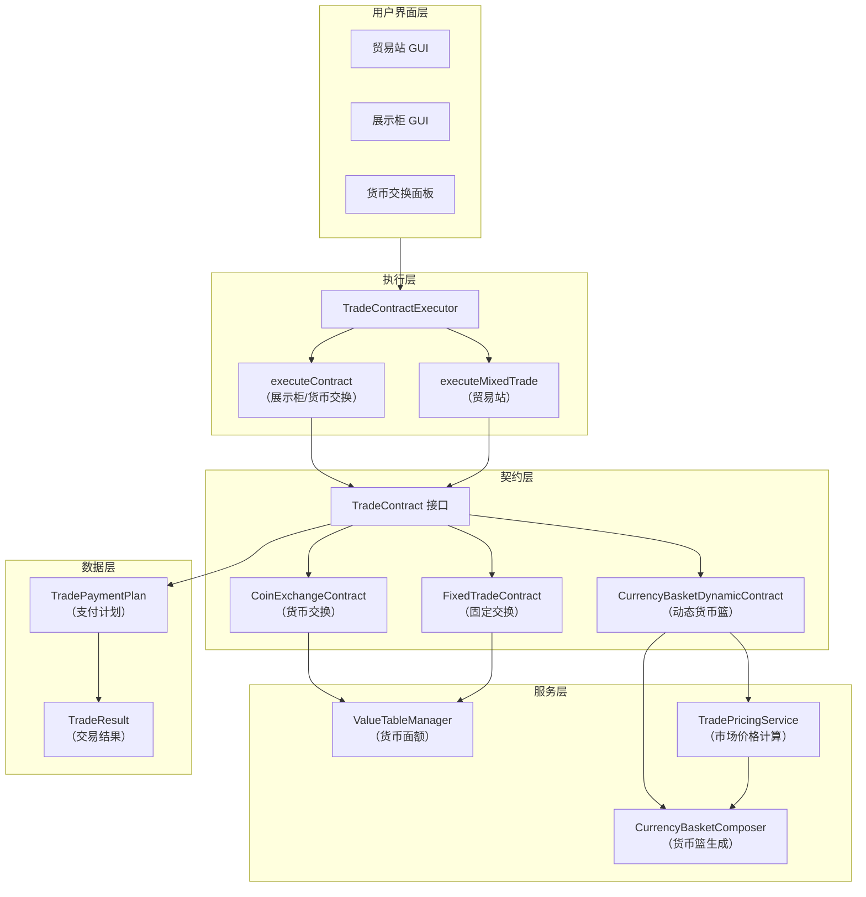
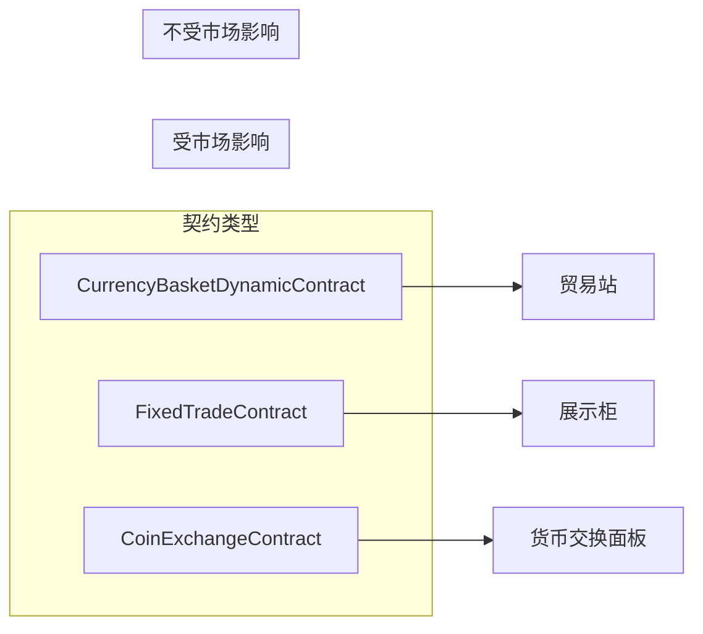
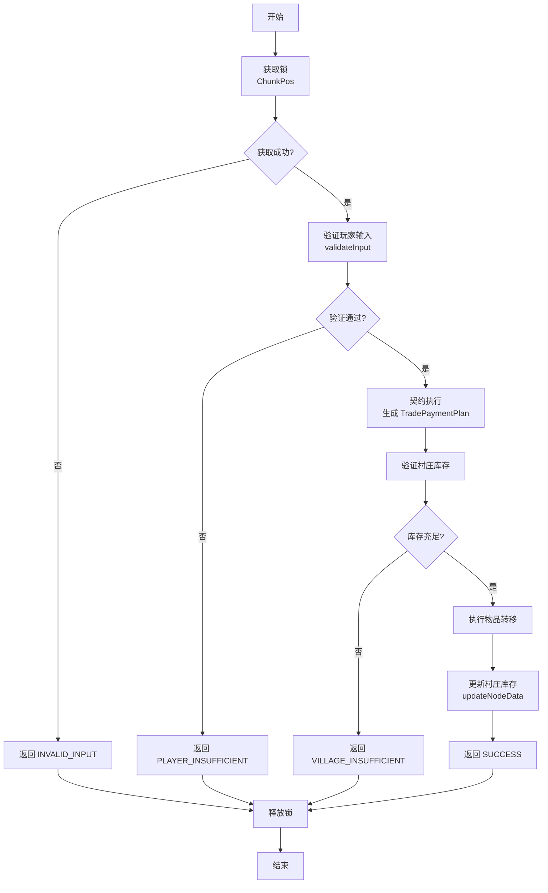
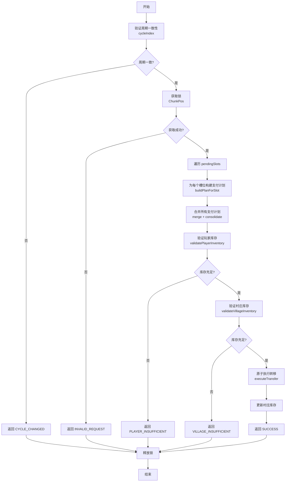
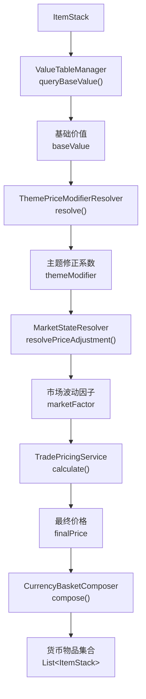
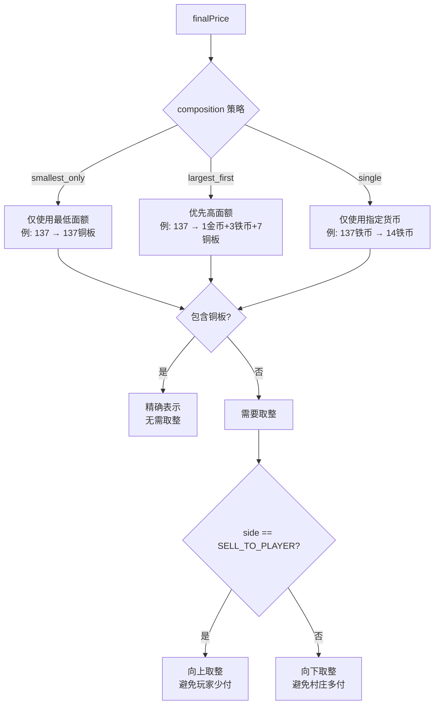
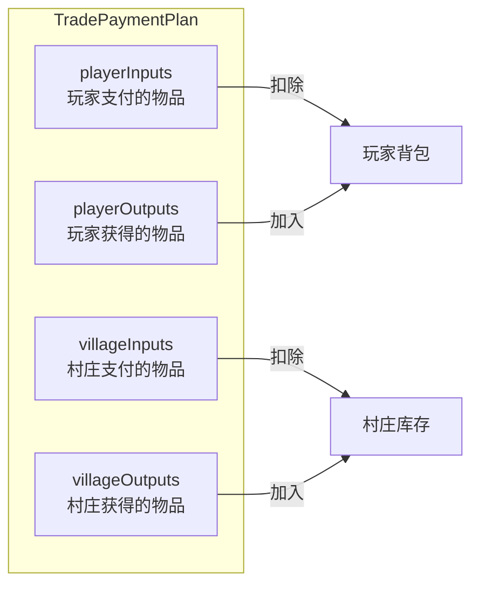
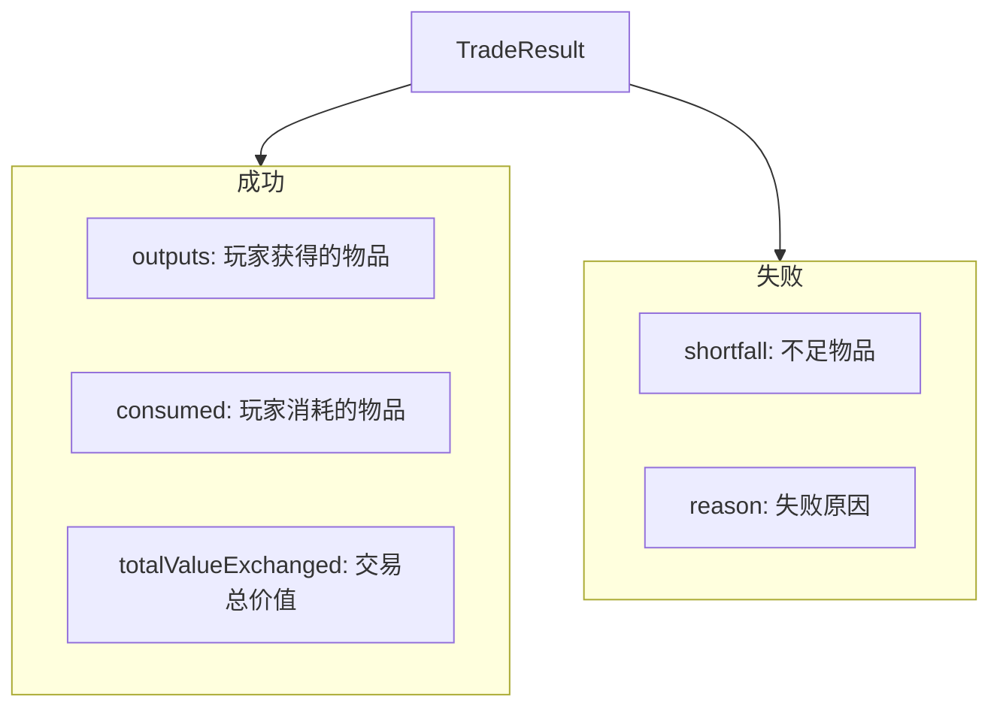
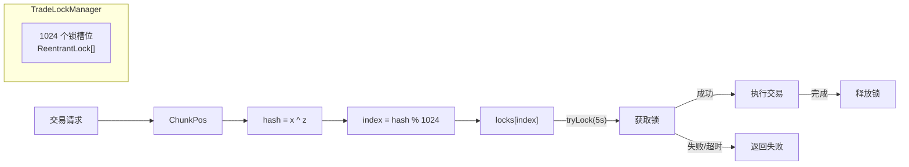
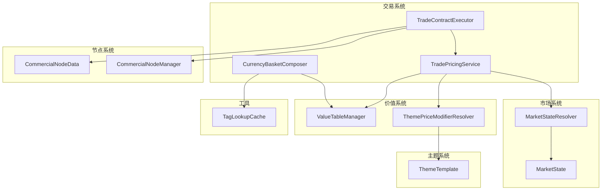

# 交易系统架构

## 核心概念

**所有交易本质都是「以物易物」**：物品集合 A → 物品集合 B，即对库存的修改操作。

- 输出物品：从村庄库存扣除
- 输入物品：加入村庄库存

库存本身有 `current` 和 `max` 限制，交易次数自然受库存数量约束。

---

## 架构总览



---

## 三种契约类型



| 契约 | 是否受市场影响 | 执行载体 | 用途 |
|------|----------------|----------|------|
| `CurrencyBasketDynamicContract` | 是 | 贸易站 | 默认铜板交易、铁币/金币/混合货币动态交易 |
| `FixedTradeContract` | 否 | 展示柜 | 固定特殊配方、剧情化交换 |
| `CoinExchangeContract` | 否 | 贸易站货币交换面板 | 面额兑换（比例动态计算） |

### CurrencyBasketDynamicContract

动态货币篮契约。核心流程：

1. 调用 `TradePricingService` 计算当前市场价格
2. 根据 `acceptedCurrencies` 和 `composition` 策略生成具体货币物品
3. 支持 `smallest_only`（仅铜板）、`largest_first`（混合）、`single`（单一货币）

示例：市场价 137，策略 `largest_first`，货币 `[金币, 铁币, 铜板]` → 报价 `1金币 + 3铁币 + 7铜板`

### FixedTradeContract

固定交换契约。预定义输入输出，不参与价格计算。

执行时直接验证玩家拥有输入物品、村庄拥有输出物品，然后执行转移。

### CoinExchangeContract

货币交换契约。兑换比例通过 `ValueTableManager` 动态计算：

- 向上兑换（低→高）：按价值比计算输入数量，输出固定 1
- 向下兑换（高→低）：输入固定 1，按价值比计算输出数量

---

## 执行流程

### executeContract（单一契约）



用于展示柜固定交换、货币交换面板兑换。

### executeMixedTrade（混合交易）



用于贸易站，从 `pendingSlots` 构建支付计划。

---

## 数据流

### 价格计算链



### 货币篮生成策略



### 货币判断与价值

- 判断货币：`TagLookupCache.matchesItem(stack, "#ruralroutes:currency")`
- 判断基础货币：`TagLookupCache.matchesItem(stack, "#ruralroutes:currency_base")`
- 获取面额：`ValueTableManager.queryBaseValue(stack)`

货币面额定义：

| 货币 | 面额价值 |
|------|----------|
| `ruralroutes:copper_coin` | 1 |
| `ruralroutes:iron_coin` | 10 |
| `ruralroutes:gold_coin` | 100 |

---

## 核心数据结构

### TradeContract（接口）

```java
public interface TradeContract {
    TradeContractType type();
    List<Component> getInputDescription();
    List<Component> getOutputDescription();
    boolean validateInput(ServerPlayer player, List<ItemStack> inputs);
    TradeResult execute(ServerLevel level, CommercialNodeData nodeData,
                        ServerPlayer player, List<ItemStack> inputs);
}
```

### TradePaymentPlan（支付计划）



明确的输入/输出物品集合，无抽象数值抵扣。

```java
public record TradePaymentPlan(
    List<ItemStack> playerInputs,    // 玩家支付的物品
    List<ItemStack> playerOutputs,   // 玩家获得的物品
    List<ItemStack> villageInputs,   // 村庄支付的物品
    List<ItemStack> villageOutputs   // 村庄获得的物品
)
```

### TradeResult（统一结果）



```java
public record TradeResult(
    Reason reason,
    List<ItemStack> outputs,
    List<ItemStack> consumed,
    List<ItemStack> shortfall,
    int totalValueExchanged
)
```

Reason 枚举：SUCCESS, PLAYER_INSUFFICIENT, VILLAGE_INSUFFICIENT, INVALID_INPUT, INVALID_REQUEST, CYCLE_CHANGED

---

## 规则定义位置

交易契约规则内嵌在**主题模板 JSON** 中。

```json
{
  "trade_contracts": [
    {
      "type": "currency_basket_dynamic",
      "side": "sell_to_player",
      "items": ["#ruralroutes:candidate/theme/plains_workshop/tool_goods"],
      "accepted_currencies": [
        "ruralroutes:iron_coin",
        "ruralroutes:copper_coin"
      ],
      "composition": "largest_first"
    },
    {
      "type": "fixed",
      "inputs": [{ "item": "minecraft:diamond", "count": 1 }],
      "outputs": [{ "item": "minecraft:emerald", "count": 3 }]
    }
  ]
}
```

---

## 并发控制



- 同一区块的交易请求串行执行
- 不同区块可并行
- 1024 个锁槽位
- 5 秒超时

---

## 文件清单

```
core/trade/
├── TradeContract.java           # 契约接口
├── TradeContractType.java       # 契约类型枚举
├── TradeContractExecutor.java   # 统一执行器
├── TradeResult.java             # 统一交易结果
├── TradePaymentPlan.java        # 支付计划
├── TradeSide.java               # 交易方向枚举
├── TradePrice.java              # 价格计算结果
├── TradePricingService.java     # 统一定价服务
├── TradeLockManager.java        # 并发锁管理
├── CurrencyBasketComposer.java  # 货币篮生成器
├── CurrencyBasketDynamicContract.java  # 动态货币篮契约
├── FixedTradeContract.java      # 固定交换契约
└── CoinExchangeContract.java    # 货币交换契约
```

---

## 与其他模块的关系



| 模块 | 依赖方式 |
|------|----------|
| 定价服务 | `TradePricingService.calculateFinalPrice()` |
| 价值表 | `ValueTableManager.queryBaseValue()` |
| 标签缓存 | `TagLookupCache.matchesItem()` |
| 市场状态 | `MarketStateResolver.resolvePriceAdjustment()` |
| 主题修正 | `ThemePriceModifierResolver.resolve()` |
| 区块数据 | `CommercialNodeData` 存储村庄库存 |
| 节点管理 | `CommercialNodeManager.updateNodeData()` |
| 主题模板 | `ThemeTemplate.tradeContracts` 定义契约规则 |

---

## 关联文档

- [交换机制](../系统/交换机制.md) - 价值框架设计
- [货币系统](../系统/货币系统.md) - 货币面额定义
- [市场定价实现](市场定价实现.md) - 价格计算服务
- [交易引擎实现](交易引擎实现.md) - 执行流程细节
- [贸易站实现](贸易站实现.md) - GUI 和暂存区
- [主题模板实现](主题模板实现.md) - 契约规则定义位置
