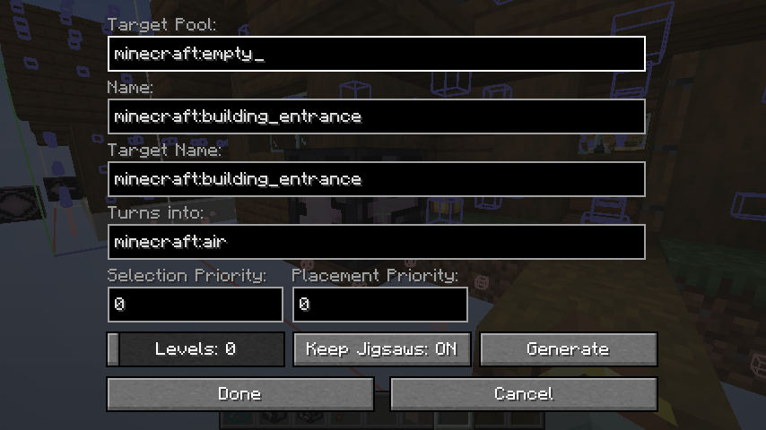
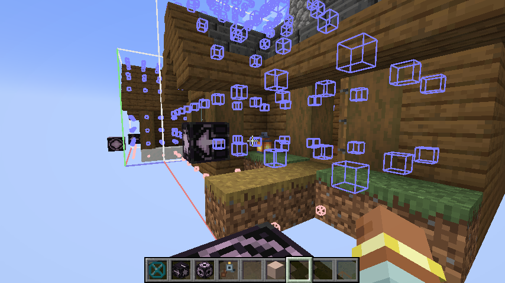

# 主题结构

主题结构是村庄里实际落地的建筑模板。它和主题模板分工不同：

- 主题模板决定村庄“是什么”
- 主题结构决定村庄“长什么样”

在本模组里，主题结构通常指一套按群系组织的 NBT 结构文件，加上一份对应的模板池 JSON。

## 核心方块

一个合格的主题结构建议包含 3 种核心方块：

- 贸易站：必须有，用来承载主题配置和交互入口。
- 传闻板：可选。
- 展示柜：可选。

## 主题设置

主题模板不是随机生成的，随机生成的是主题结构。

放下贸易站后，使用模组的配置工具右键贸易站，在 UI 中选择对应主题并确认。**确认之后不要再右键贸易站**，否则模板保存会把方块实体数据一起写入，导致后续节点数据出现错误。

传闻板和展示柜放在贸易站旁边即可，只要在 16 格范围内，玩家第一次右键打开时会自动检测并设置。

## 文件位置

```text
data/ruralroutes/structure/village/<群系>/<主题名>.nbt
data/ruralroutes/worldgen/template_pool/village/<群系>/trade_stations.json
```

`<namespace>` 必须使用 `ruralroutes`。

### 1. 先做结构文件

把建筑导出成 NBT，放到对应群系目录下。

```text
data/ruralroutes/structure/village/plains/plains_granary.nbt
data/ruralroutes/structure/village/plains/plains_pasture.nbt
```

### 2. 再写入模板池

在对应群系的 `trade_stations.json` 里列出这些结构：

```json
{
  "name": "ruralroutes:village/plains/trade_stations",
  "fallback": "minecraft:village/plains/terminators",
  "elements": [
    {
      "weight": 1,
      "element": {
        "element_type": "minecraft:single_pool_element",
        "location": "ruralroutes:village/plains/plains_granary",
        "processors": { "processors": [] },
        "projection": "rigid"
      }
    },
    {
      "weight": 1,
      "element": {
        "element_type": "minecraft:single_pool_element",
        "location": "ruralroutes:village/plains/plains_pasture",
        "processors": { "processors": [] },
        "projection": "rigid"
      }
    }
  ]
}
```

### `trade_stations.json` 结构

| 字段 | 说明 |
| :--- | :--- |
| `elements` | 可被选择的主题结构列表。每个对象对应一个 `.nbt` 结构。 |

`elements` 中每个对象包含：

| 字段 | 说明 |
| :--- | :--- |
| `weight` | 该结构的选择权重。数值越高，被选中的概率越高。 |
| `element` | 结构元素定义。 |

## 拼图方块

由于这里使用的是原版拼图结构生成逻辑，主题结构中需要在边缘放置并设置拼图方块，才能正确生成。
如果你不知道怎么设置，可能参考下面的图片。





## 相关文档

- [主题模板](主题模板.md)
- [村庄资源身份](../../系统/村庄资源身份.md)
