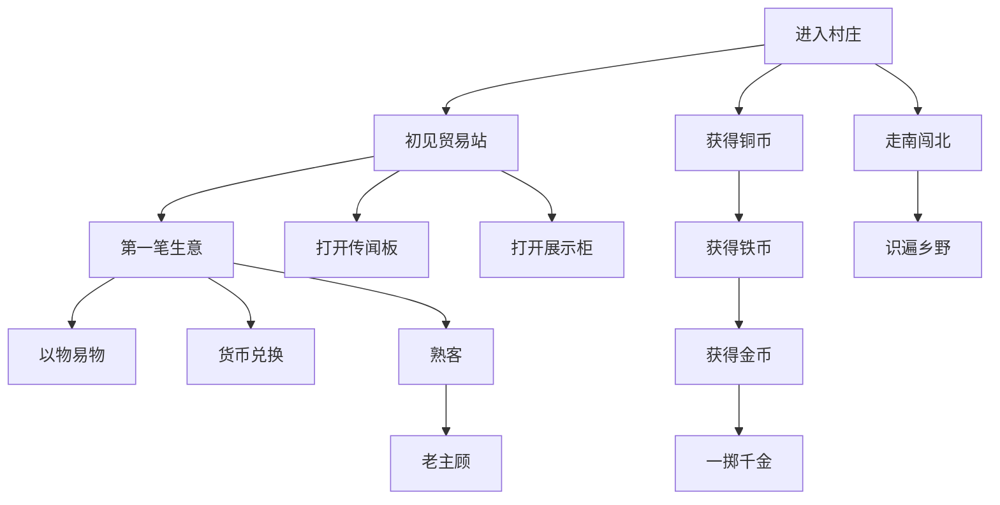

# 模组进度

## 定位

这里说的“进度”指本模组自己的 advancement 树。

它的职责不是兼容原版进度，也不是把玩法拆成一串教程步骤，而是把玩家对模组的理解顺序整理成一棵可追踪、可回忆的树。

## 设计原则

- 进度负责“点题”，系统负责“说服”
- 主线只教最小必要概念，支线再补货币、旅行与挑战
- 标题保持简短，描述只写玩家行为，不暴露实现术语
- 图标尽量不重复：模组入口节点用模组方块，旅行/挑战/收集节点优先用原版象征物

## 当前进度树

## 节点分工

### Root 与主线

| 节点 | 作用 | 类型 | 图标 |
| :--- | :--- | :--- | :--- |
| 进入村庄 | 声明模组入口在村庄中 | `task` | `minecraft:bell` |
| 初见贸易站 | 让玩家知道贸易站是模组主入口 | `task` | `ruralroutes:trade_station` |
| 第一笔生意 | 让玩家理解村庄交换是真正可用的资源路径 | `task` | `minecraft:emerald` |
| 以物易物 | 介绍固定合约交易 | `task` | `minecraft:bundle` |
| 货币兑换 | 介绍面额兑换功能 | `task` | `minecraft:gold_nugget` |

### 信息支线

| 节点 | 作用 | 类型 | 图标 |
| :--- | :--- | :--- | :--- |
| 打开传闻板 | 告诉玩家村庄提供外部信息入口 | `task` | `ruralroutes:rumor_board` |
| 打开展示柜 | 告诉玩家村庄会陈列当期出售商品 | `task` | `ruralroutes:display_case` |

### 货币支线

| 节点 | 作用 | 类型 | 图标 |
| :--- | :--- | :--- | :--- |
| 获得铜币 | 让玩家第一次感知模组货币 | `task` | `ruralroutes:copper_coin` |
| 获得铁币 | 引入更高面额 | `task` | `ruralroutes:iron_coin` |
| 获得金币 | 引入最高面额 | `task` | `ruralroutes:gold_coin` |
| 一掷千金 | 表达高价值交易已进入玩法节奏 | `goal` | `minecraft:gold_block` |

### 旅行与挑战

| 节点 | 作用 | 类型 | 图标 |
| :--- | :--- | :--- | :--- |
| 走南闯北 | 让玩家意识到不同风格村庄值得到访 | `goal` | `minecraft:compass` |
| 识遍乡野 | 鼓励完成全部主题村庄探索 | `challenge` | `minecraft:filled_map` |
| 熟客 | 记录玩家的稳定交易积累 | `challenge` | `minecraft:written_book` |
| 老主顾 | 承接更长期的交易目标 | `challenge` | `minecraft:enchanted_book` |

## 当前判定口径

### 一次性节点

- `进入村庄`：首次进入 `#minecraft:village`
- `初见贸易站`：首次成功打开贸易站
- `第一笔生意`：首次完成常规交易
- `以物易物`：首次完成一次固定合约交易
- `货币兑换`：首次完成一次货币兑换
- `打开传闻板`：首次打开已激活传闻板
- `打开展示柜`：首次打开已激活展示柜
- `熟客`：成功完成 `10` 次常规交易
- `老主顾`：成功完成 `100` 次常规交易
- `一掷千金`：完成一笔交易额达到 `300` 的大单

### 旅行线

- `走南闯北`：在五种 `VillageStyle` 对应的村庄中各找到一次贸易站
- `识遍乡野`：在当前所有主题村庄中各找到一次贸易站

旅行线采用原版 `adventuring_time` 风格的多 criterion 结构：

- `走南闯北` 在界面中显示为 `x/5`
- `识遍乡野` 在界面中显示为 `x/N`

这里的 `N` 由当前主题定义数量自动决定。按当前首批主题集，实际显示为 `x/15`。

若运行时加载了玩家自定义主题：

- 只要主题能被正常解析，交易与村庄行为仍可照常运行
- `识遍乡野` 只统计模组内置主题，不把玩家自定义主题纳入官方收集目标
- `走南闯北` 对无法映射到已知 `VillageStyle` 的自定义 biome 不计入风格进度，但也不会报错

## 文案与图标规则

- 标题优先使用短语，不解释技术细节
- 描述直接指向玩家动作，如“找到贸易站”“查看展示柜”“完成一次货币兑换”
- 同一分支内部的图标避免重复，尽量让玩家只靠图标就能看出“入口 / 收集 / 旅行 / 挑战”这几类节点的差别

## 相关

- [概述](../概述.md) - 项目入口与导航
- [交换机制](交换机制.md) - 常规交易、固定合约与支付结构
- [村庄资源身份](村庄资源身份.md) - 风格、主题与清单来源
- [货币系统](货币系统.md) - 面额与兑换
- [市场波动](市场波动.md) - 传闻板所承接的信息背景
- [进度实现](../技术/进度实现.md) - datagen、trigger 与累计进度实现
